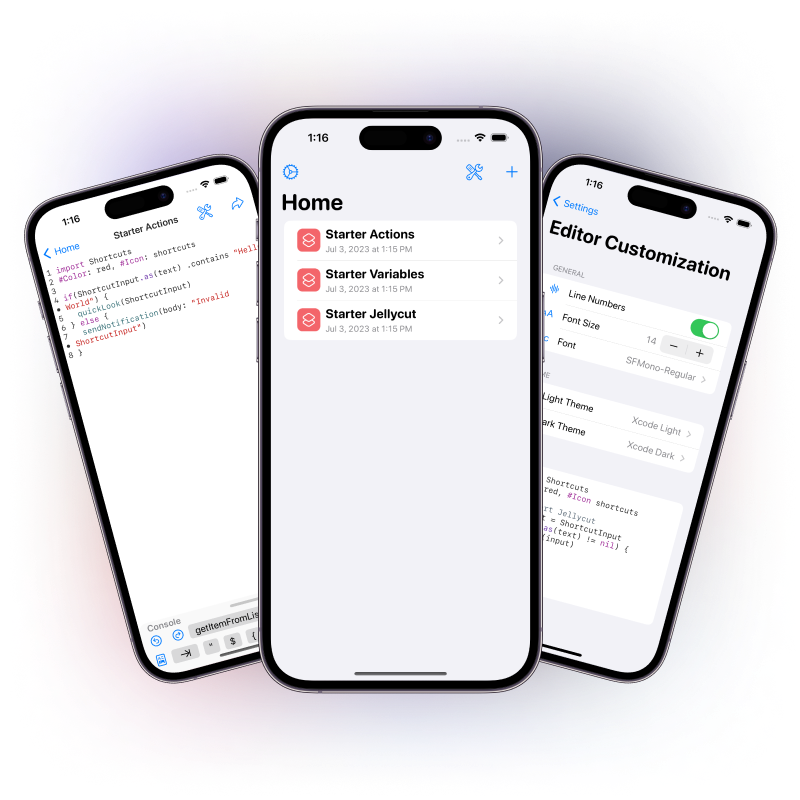

# Open Jellycuts


Jellycuts is an iOS app that allows anyone to write Siri Shortcuts in an easy to use scripting language. The language, Jelly, is based off of Swift, Python and Javascript and focused on being easy to learn and use. 

## Packages
This version of Jellycuts aims to use more modern Open Source packages for everything, improving upon the previous version of Jellycuts. Specifically this version includes [Runestone](https://github.com/simonbs/Runestone) and [Tree-Sitter](https://tree-sitter.github.io/tree-sitter/) as the backend for the text editor and language parsing.

- [Open Jellycore](https://github.com/ActuallyTaylor/Open-Jellycore)
    - This package handels the actual compilation of Jellycuts into Shortcuts
- [Tree-Sitter Jelly Grammar](https://github.com/ActuallyTaylor/tree-sitter-jelly)
    - This package is a SPM distribution of a Tree-Sitter grammar for the Jelly language. This handles all of the parsing of Jelly done by both Jellycore and Runestone.

## Features (Compared to closed Jellycuts)
| Feature                    | Open Jellycuts                    | Private Jellycuts |
| -------------------------- | --------------------------------- | ----------------- |
| Open Jelly Files           | ✅                                | ✅                |
| Edit Jelly Files           | ✅                                | ✅                |
| Create Jelly Files         | ✅                                | ✅                |
| Compile Jell Files         | ✅                                | ✅                |
| Error Reporting            | ✅                                | ✅                |
| Project Settings           | ❌                                | ✅                |
| Documentation              | ✅                                | ✅                |
| Icon Creator               | ✅                                | ✅                |
| Dictionary Builder         | ✅ (No support for nested arrays) | ✅                |
| Jellycuts Bridge           | ✅                                | ✅                |
| Third-Party Object Storage | ❌ (Needs support in Jellycore)   | ✅                |
| Learning Center            | ❌                                | ✅                |
| Changelogs                 | ❌                                | ✅                |
| Editor Customization       | ✅                                | ✅                |
| App Icons                  | ✅                                | ✅                |
| App Tint                   | ✅                                | ✅                |
| Haptic Feedback            | ✅                                | ✅                |
| External Safari            | ✅                                | ✅                |
| Project Sort               | ✅                                | ✅                |
| Privacy Page               | ✅                                | ✅                |
| Credits Page               | ✅                                | ✅                |
| About Page                 | ✅                                | ✅                |
| Contact & Bug Report       | ✅                                | ✅                |
| Version 1 Projects         | ✅                                | ✅                |
| Version 2 Projects         | ✅                                | ✅                |
| Add Jellycut File          | ✅                                | ✅                |
| Import From iCloud         | ❌ (New Helper & Core Support)    | ✅                |
| Import from Shortcuts      | ❌ (New Helper & Core Support)    | ✅                |

### Current Limitations
The following sections talk about all of the limitations that are currently holding back the Jellycuts app from having feature parity with the closed source Jellycuts version. 

#### No support for nested arrays
The dictionaries that are created by Open Jellycuts need to be reworked so they support adding Arrays within Arrays. The datatype `DictionaryHandler.JellycutsDictionary` should be fully capable of supporting this however the UI fails when adding arrays as children of arrays.

#### New Helper & Core Support
These two features, Import from iCloud and Import from Shortcuts, need a new Jellycuts Helper shortcut to be built. They also require a shortcuts parser -> Jelly language. This is a feature that should be added into [Open Jellycore](https://github.com/ActuallyTaylor/Open-Jellycore) and then interfaced within Open Jellycuts.

#### Needs support in Jellycore
Features with this flag need support to be built into [Open Jellycore](https://github.com/ActuallyTaylor/Open-Jellycore). The most prominent issue is that the current [Open Jellycore](https://github.com/ActuallyTaylor/Open-Jellycore) does not support Objects. This means that any features that used objects are no longer available as there is no way to use them during compilation.

## Building the App Yourself
See the [Contribution Guidelines](./CONTRIBUTING.md#your-first-code-contribution) for more information on building the app.

### The Gist
#### Cloning
To clone the repository it is critical that you use the `--recursive` flag. This will ensure you properly clone all of the submodules.
```
git clone --recursive https://github.com/ActuallyTaylor/Open-Jellycuts.git
```

#### Adding a Key Provider
After you have cloned the repository and set up signing, you will see a build error. This error is caused by the PurchaseHandler not having a provided publicKey. This code is initially commented out because the file is a secondary file to an internal file that provides the App Store validation with a public key for verifying results from the server. 

All you need to do is uncomment the following line in `Open-PublicKey.swift`:

```swift
extension PurchaseHandler: PublicKeyProvider {
    static var publicKey: String {
        "INSERT_PUBLIC_SIGNING_KEY"
    }
}
```
